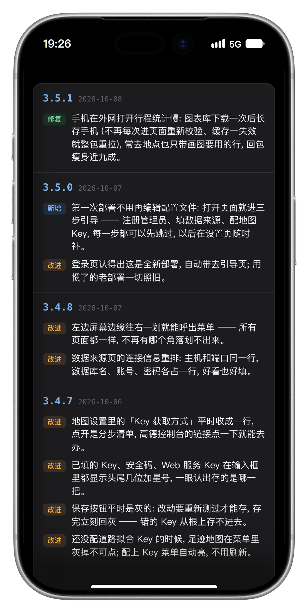

<div align="center">

# 🚗 My Tesla

**TeslaMate 行车数据的自托管展示应用** — 充电 · 足迹 · 行程 · 实时位置

[](https://github.com/kinopico-zhang/my-tesla/actions/workflows/ci.yml)
[](./LICENSE)


</div>

<p align="center">


</p>

|      |      |      |
|:----:|:----:|:----:|
| <br>**状态** | <br>**行程列表** | <br>**行程统计** |
| <br>**行程分组** | <br>**足迹地图** | <br>**充电记录** |
| <br>**充电统计** | <br>**电池健康** | <br>**充电地图** |
| <br>**更新日志** |  |  |

## ✨ 功能

- 🔋 **充电** — 充电记录 (费用 / 区域统计) · 充电统计 · 充电地图
- 🗺️ **足迹地图** — 行车轨迹 + 道路拟合 (WGS-84 → GCJ-02 纠偏), 轨迹断档自动补路
- 🎬 **行程** — 行程列表 · 行程统计 · 行程分组 · 轨迹回放动画
- 🚗 **实时位置** — 当前驾驶状态
- 🩺 **电池健康**
- 🚙 **多车切换** — 车辆选择住抽屉顶, 全视图跟着切
- 🧭 **单壳移动优先 UI** — 左缘右划呼出抽屉, 手势导航 (任意页通用)
- ⚙️ **应用内设置** — TeslaMate 连接 · 高德 Key · 驾驶员 · 常用地点, 改完即生效

## 🚀 快速开始

需要 Python 3.13+ (venv) 与一个能连上的
[TeslaMate](https://docs.teslamate.org/) PostgreSQL 库:

```sh
python3.13 -m venv .venv
.venv/bin/pip install -r requirements.txt -r requirements-dev.txt
.venv/bin/python -m app   # 配置全走命令行参数 (--help 看全量); 全默认首启走 /setup 引导
```

启动入口 `python -m app` (Windows 下 `.venv\Scripts\python -m app`), 部署
配置全走命令行参数 (`--help` 一屏看全)。端口只有一个: `data/certs/` 里
放了证书 (`fullchain.pem` + `privkey.pem`) 就走 HTTPS, 没放走 HTTP,
`--http` 可强制明文 (调试)。

打开 `http://<host>:8500/` → 自动进 `/tesla/charging`。账号库为空时
登录页会带去 `/setup` 引导页: 注册第一个管理员, 顺路配 TeslaMate 连接
与地图 Key, 全部可跳过、之后在设置页随时补。

## 📡 数据源

TeslaMate 连接三种给法 (优先级从高到低): 设置页里填 (存自有库, 改完热
重连实测) → 启动参数 `--teslamate-*` (回落环境变量 `TMDB_*`) → docker
容器定位 (与 TeslaMate 同机部署时)。数据只读, 不会往 TeslaMate 库写任何
东西。

高德 Key (服务平台选「Web端 JS API」, 个人开发者免费) 在设置页
「地图设置」里保存, 保存即生效; 未配置时地图页显示申请指引。

自有数据落在 `data/` (git 忽略): `mytesla.db` (轨迹断档补路等自产数据)
+ `users.db` 账号 + `certs/` 证书。

## ⚙️ 启动参数

全量清单 `python -m app --help` (分组帮助即部署文档), 常用项:

| 参数 | 默认 | 说明 |
|---|---|---|
| `--port` | `8500` | 端口: 证书目录有证书走 HTTPS, 没证书走 HTTP |
| `--teslamate-host` 等 | docker 定位 | TeslaMate PostgreSQL (设置页里填的优先) |
| `--mytesla-db` | `sqlite:///data/mytesla.db` | 自有库 (自产数据) |
| `--users-db` / `--secret-file` | `data/users.db` / `.session_secret` | 账号库与会话密钥 |
| `--tz` / `--currency` | `Asia/Shanghai` / `¥` | 显示口径 |

参数没给的回落同名环境变量 (如 `--teslamate-host` → `TMDB_HOST`), 再回落
内置默认 —— 显式参数 > 环境变量 > 默认, 自动化与容器注入仍可走环境变量。

## 🧪 测试与质量门禁

```sh
npm install               # 前端工具链 (eslint/tsc/stylelint/html-validate/c8)
./run_tests.sh            # pylint + mypy + pytest + 前端全套 + 覆盖率门禁
```

门禁全绿才算过: pylint 10.00/10 (app 严检) · mypy 严格模式 · pytest 439 例
(真实 ORM + SQLite 临时库, 不碰真实数据; 含 e2e 冒烟: 起真 uvicorn
子进程打真 HTTP —— 登录 → 页面 → 静态资源, 与 python -m app 生产路径同构) · ESLint / tsc --checkJs /
stylelint / html-validate / node --test · c8 覆盖率 ≥95% (纯逻辑模块)。
CI 在 GitHub Actions 三平台跑同一套门禁。

## 📁 项目结构

```
app/
  tesla/         Tesla 应用本体 (repository 查询层 + routers 路由与页面)
  home/          账号层 (登录/注册/账号管理页面 + /api 会话接口 + 中间件)
  database/      三引擎: teslamate 库 / 自有库 / 账号库
  account_store/     账号库存取 (scrypt 密码 + 注册邀请)
  authentication.py  会话 cookie 签发与校验 (HMAC)
  cli.py / __main__.py  命令行启动器 (python -m app): 参数全量清单 + 单端口 TLS 判定
  main.py        独立装配: 账号层挂根, 应用挂 /tesla
tests/           pytest (真实 ORM + SQLite 临时库) + node --test (纯逻辑模块)
```

## 📄 许可证

[MIT](./LICENSE) © 2026 kinopico
