<div align="center">

#  My Tesla

**TeslaMate 可视化工具**

[](https://github.com/kinopico-zhang/my-tesla/actions/workflows/ci.yml)
[](./LICENSE)


</div>

## ✨ 功能

<p align="center">
<a name="shot-live">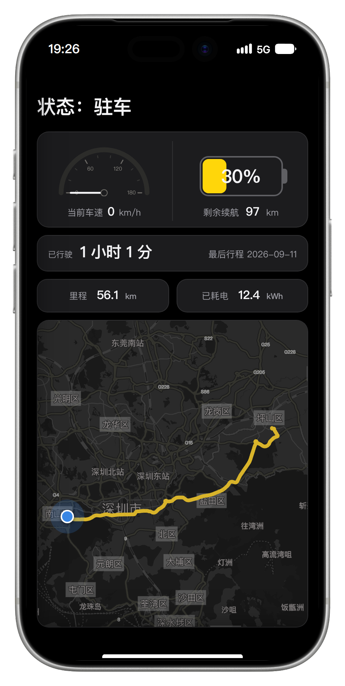</a>
<br><b>状态</b> — 车停在哪、还剩多少电、还能跑多远, 打开即见
</p>

<p align="center">
<a name="shot-trips">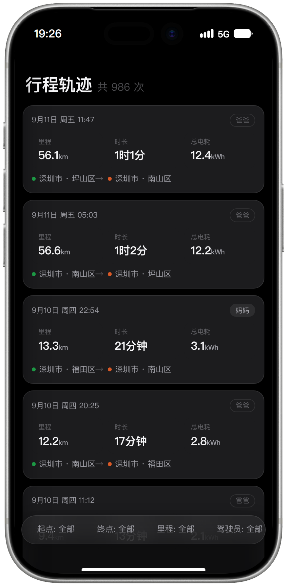</a>
<br><b>行程轨迹</b> — 每一趟去了哪、开了多久、耗了多少电, 随时翻旧账
</p>

<p align="center">
<a name="shot-trip">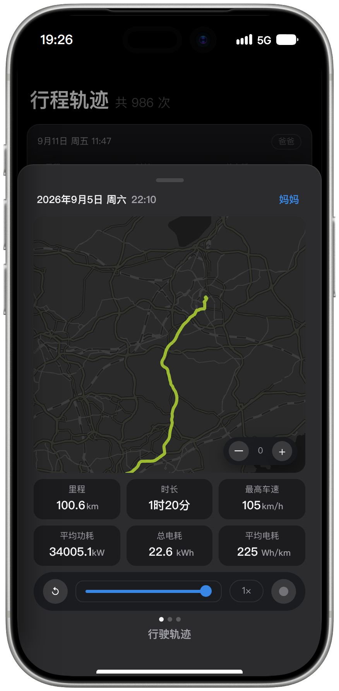</a>
<br><b>单个行程</b> — 回放这一趟怎么开的: 路线按车速着色, 横滑看速度与电耗曲线
</p>

<p align="center">
<a name="shot-tripstats">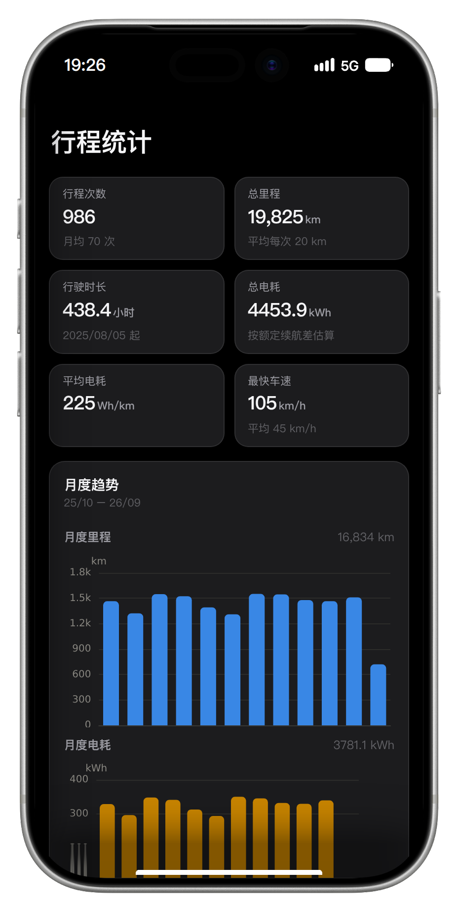</a>
<br><b>行程统计</b> — 一段时间开了多少公里、平均电耗多少, 趋势与分布一眼看完
</p>

<p align="center">
<a name="shot-groups">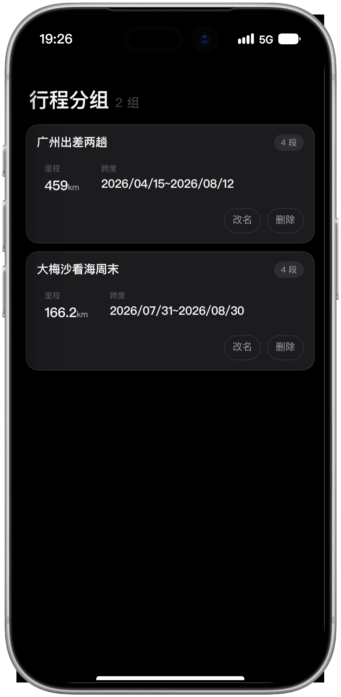</a>
<br><b>行程分组</b> — 出差、周末出行各归一册, 分开算用车账
</p>

<p align="center">
<a name="shot-map">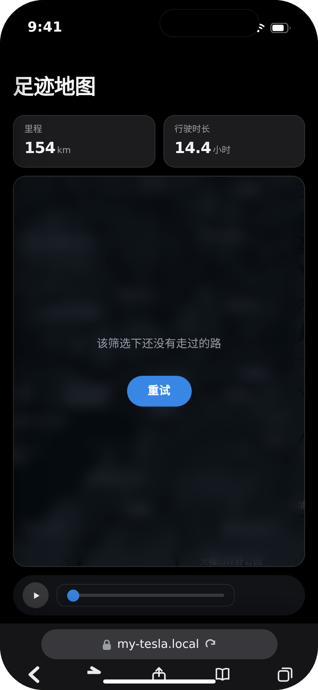</a>
<br><b>足迹地图</b> — 车轮碾过的每条路都亮在地图上, 拖时间轴回放这些年跑过的路
</p>

<p align="center">
<a name="shot-charging">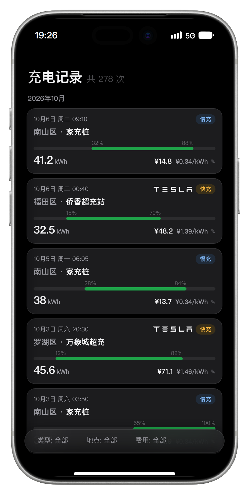</a>
<br><b>充电记录</b> — 每次在哪充、充了多少、花了几块钱, 按区域翻查
</p>

<p align="center">
<a name="shot-stats">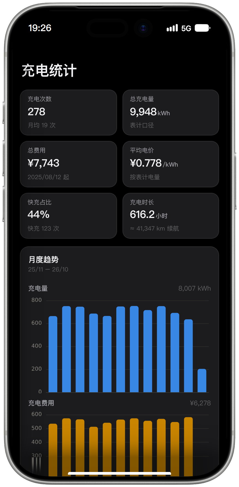</a>
<br><b>充电统计</b> — 每月充电量与花销的趋势, 用电的账一清二楚
</p>

<p align="center">
<a name="shot-battery">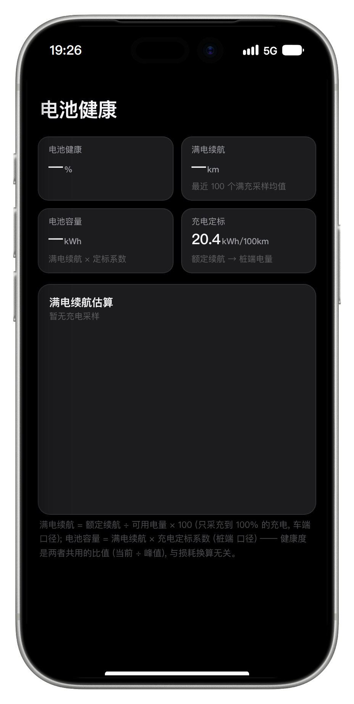</a>
<br><b>电池健康</b> — 电池还剩几成、衰减快不快, 曲线直接说话
</p>

<p align="center">
<a name="shot-chargemap">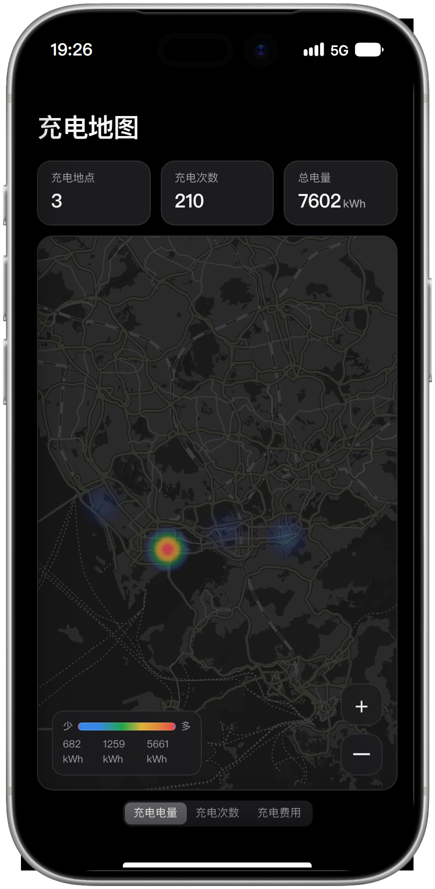</a>
<br><b>充电地图</b> — 常去充电点的地理分布, 陌生地方先看哪里充过电
</p>

## 🚀 部署

### 准备 · TeslaMate 连接参数

会来用 My Tesla 的人必然已经装好了 TeslaMate (还没装的看官方文档
[docs.teslamate.org](https://docs.teslamate.org/))。My Tesla 只读它的
PostgreSQL, 不往回写任何东西。数据链路:

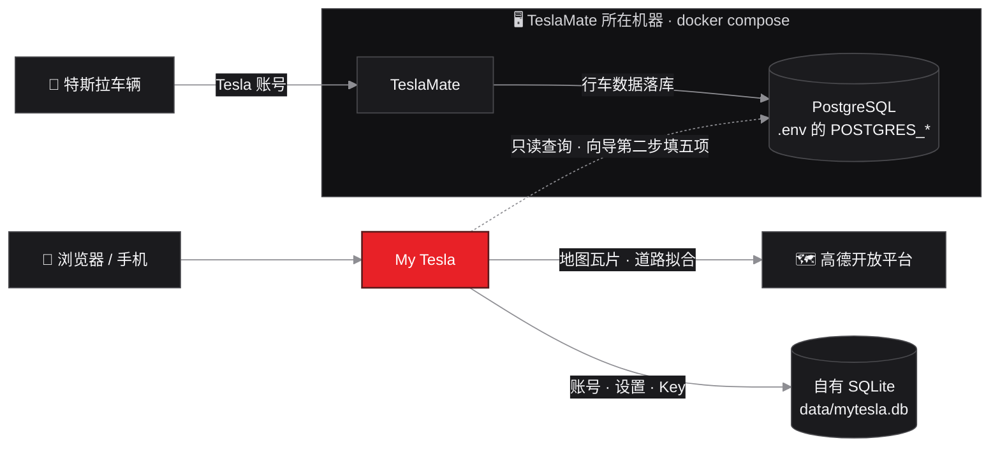

首启向导第二步 (或之后的 设置 → 数据库) 要填的五项, 全部在 TeslaMate
那台机器的 `docker-compose.yml` / `.env` 里:

| 表单字段 | TeslaMate 那边 | 默认 |
|---|---|---|
| 地址 | 跑 TeslaMate 的那台机器 (见下) | — |
| 端口 | `database` 服务映射到宿主的端口 | `5432` |
| 用户 | `POSTGRES_USER` | `teslamate` |
| 密码 | `POSTGRES_PASSWORD` | — |
| 库名 | `POSTGRES_DB` | `teslamate` |

想不起来值, 在 TeslaMate 的 compose 目录里一条命令全打出来 (密码也在
里面):

```sh
docker compose exec database env | grep -E '^POSTGRES_'
```

地址只有一件事要注意: 官方 compose 默认**不**把 5432 发布到宿主 (只在
compose 内部网络互通), 跨机器访问要先给 `database` 服务加端口映射再重建
(加完 `docker compose up -d`):

```yaml
  database:
    ports:
      - "5432:5432"
```

- **My Tesla 装在别的机器** (常见): 地址填 TeslaMate 那台机器的 IP,
  端口 `5432`, 防火墙放行;
- **同一台机器**: 同样加端口映射, 地址填 `localhost`。

### 准备 · Python 环境

需要 Python 3.13+:

```sh
python3.13 -m venv .venv          # Windows: py -3.13 -m venv .venv
.venv/bin/pip install -r requirements.txt
```

### 启动

```sh
.venv/bin/python -m app           # Windows: .venv\Scripts\python -m app
```

配置全走命令行参数 (`--help` 一屏看全), 端口只有一个 `8500`, 分两种情况:

- **有证书**: `fullchain.pem` + `privkey.pem` 放进 `data/certs/` 再启动,
  走 `https://<host>:8500/`;
- **没证书**: 直接启动, 走 `http://<host>:8500/` (`--http` 可强制明文,
  调试用)。

打开后自动进 `/tesla/charging`。首次打开先走设置向导, 三步: 注册管理员
账号 → 填 TeslaMate 的 PostgreSQL 连接 (主机/端口/账号/密码/库名, 保存即
实测连通) → 填高德 Key。三步配齐才能进应用, 一步不能跳; 中途关掉下次
从缺的那步接着配。之后想改, 设置页随时改。

<p align="center">
<a name="shot-setup-1">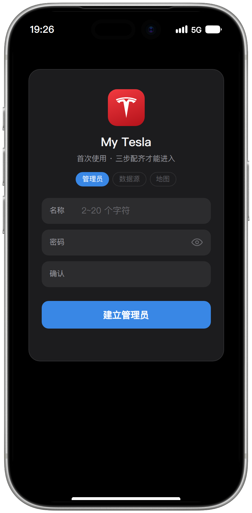</a>
<a name="shot-setup-2">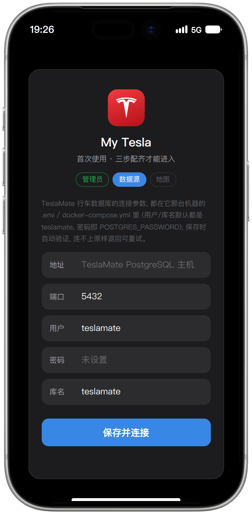</a>
<a name="shot-setup-3">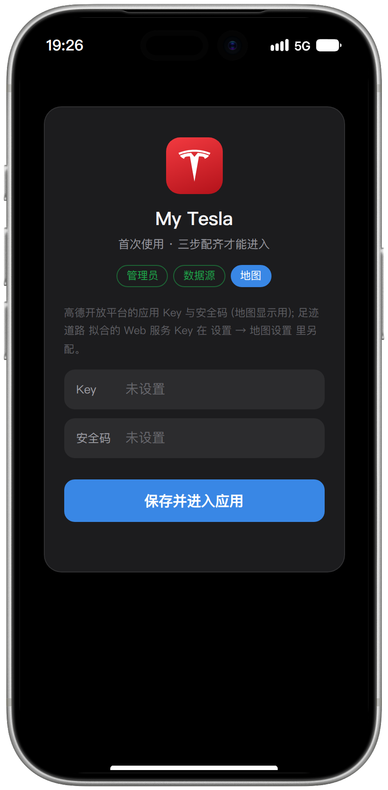</a>
<br><b>① 建立管理员</b> — 注册即登录 · <b>② 数据源</b> — 五项按上表抄
TeslaMate 那台机器 · <b>③ 地图</b> — 高德 Key, 保存并进入应用
</p>

## 📡 数据源

TeslaMate 连接只有一条路: 首启向导 (或之后的设置页) 里填, 保存即热重连
实测。数据只读, 不会往 TeslaMate 库写任何东西。

高德 Key (服务平台选「Web端 JS API」, 个人开发者免费) 未配置时地图页
显示申请指引。

自有数据落在 `data/` (git 忽略): `mytesla.db` (轨迹断档补路等自产数据)
+ `users.db` 账号 + `certs/` 证书。

## ⚙️ 启动参数

全量清单 `python -m app --help` (分组帮助即部署文档), 常用项:

| 参数 | 默认 | 说明 |
|---|---|---|
| `--port` | `8500` | 端口: 证书目录有证书走 HTTPS, 没证书走 HTTP |
| `--mytesla-db` | `sqlite:///data/mytesla.db` | 自有库 (自产数据) |
| `--users-db` / `--secret-file` | `data/users.db` / `.session_secret` | 账号库与会话密钥 |
| `--tz` / `--currency` | `Asia/Shanghai` / `¥` | 显示口径 |

参数没给的回落同名环境变量, 再回落内置默认 —— 显式参数 > 环境变量 >
默认, 自动化与容器注入仍可走环境变量。

## 📄 许可证

[MIT](./LICENSE) © 2026 kinopico
